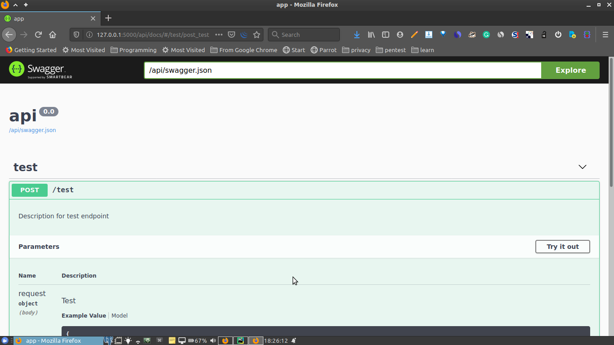

# Flask-APi Starter

[](https://flask.palletsprojects.com/en/1.1.x/)

Flask-APi Starter Template With Application Context and SqlAlchemy
  - Flask Application Context
  - Flask Restfull2 for api endpoints
  - Flask SqlAlchemy 

 
 
##### This WireFrame uses a number of open source projects to work properly:
* [Flask](https://flask.palletsprojects.com/en/1.1.x/) - A Micro Web Framework
* [Flask restful ](https://flask-restful.readthedocs.io/en/latest/) - Flask extension for building REST APIs
* [Flask restfull Swagger 2](https://github.com/soerface/flask-restful-swagger-2.0) - A Swagger spec extractor for flask-restful 
* [Flask CORS](https://flask-cors.readthedocs.io/en/latest/) - A Flask extension for handling Cross Origin Resource Sharing (CORS), making cross-origin AJAX possible
* [Python Dotenv](https://pypi.org/project/python-dotenv/) - For managing app settings during development and in production
* [Flask-SQLAlchemy](https://pypi.org/project/python-dotenv/) - an extension for Flask that adds support for SQLAlchemy 


### Installation

This app requires [python 3.x.x](https://www.python.org/)  to run.
#### It is always recommended to use a virtual environment while developing Python applications 

##### Installing Virtual env on Linux.
```sh
$ sudo apt-get install python3-pip
$ sudo pip3 install virtualenv
```
##### Then create the virtualEnv using
```sh
$ virtualenv venv 
$ source venv/bin/activate
```

#### Configuration of environments Variables and application

 - Edit the .env file to set environments variables like the database URI and other necessary environment variables (This file is loaded by python-dotenv when the app starts and the environment variables declared in the .env file are available for use in the app)
 
 - Edit the .flaskenv for the flask app configuration (The .flaskenv file is automatically imported by the flask command)


##### Then install install Requirements
```sh
$ pip install -r requirements.txt 
$ flask run
```
Navigate to your server address in your preferred browser.
```sh
127.0.0.1:5000
```
 




####### Other endpoints and customizations can then be added, THIS IS JUST A BASIC BOILERPLATE
 

##### Database migrations can also be made
```sh
$ flask db init
$ flask db migrate
$ flask db upgrade
```

### Development
Want to contribute? Great!

Feel free to reachout
 

### Todos

 - Implementation of marshmallow (for object serialization/deserialization)
 - Addition of JWT

License
----

MIT


**Free Software, Hell Yeah!**
